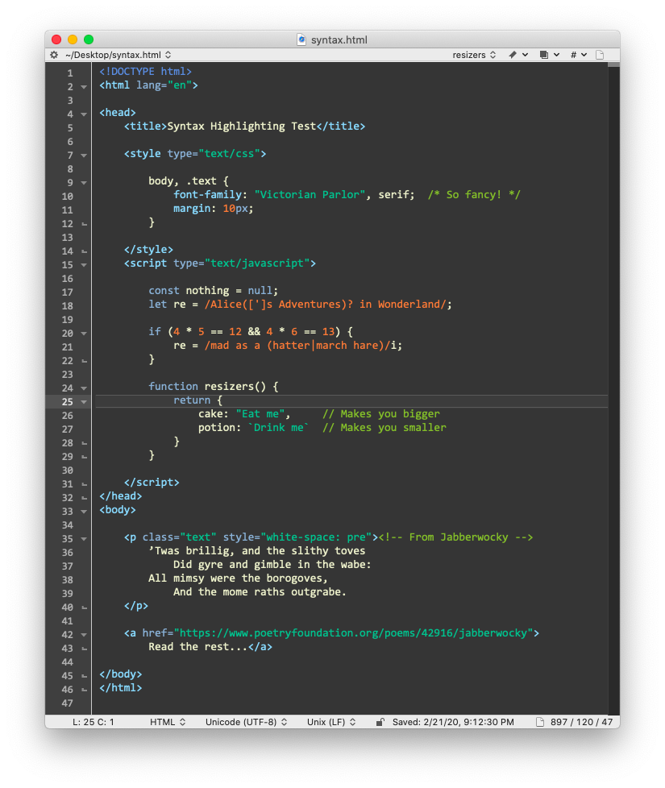
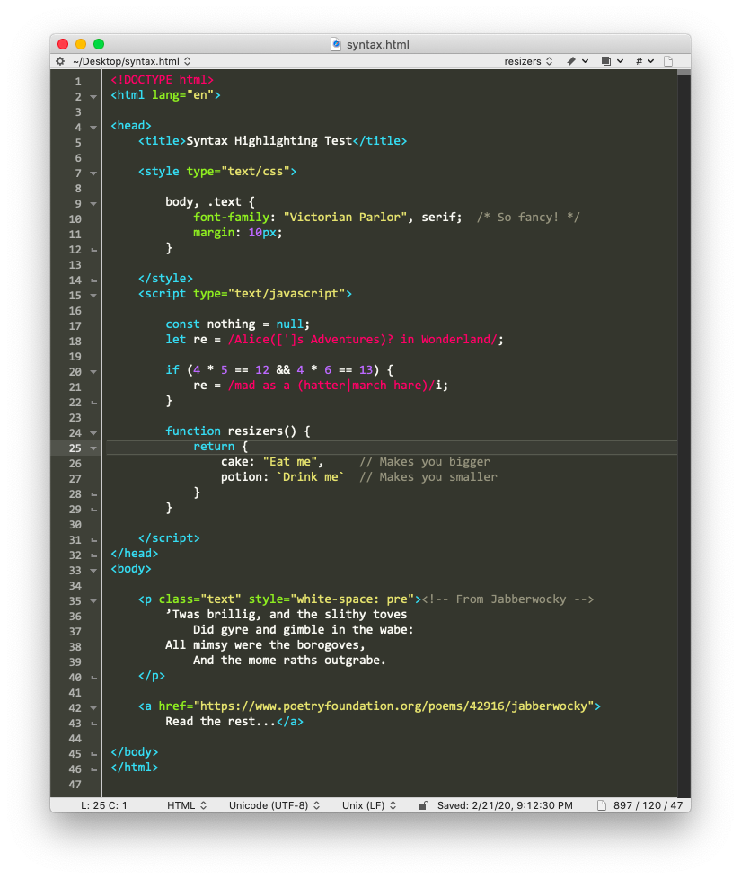
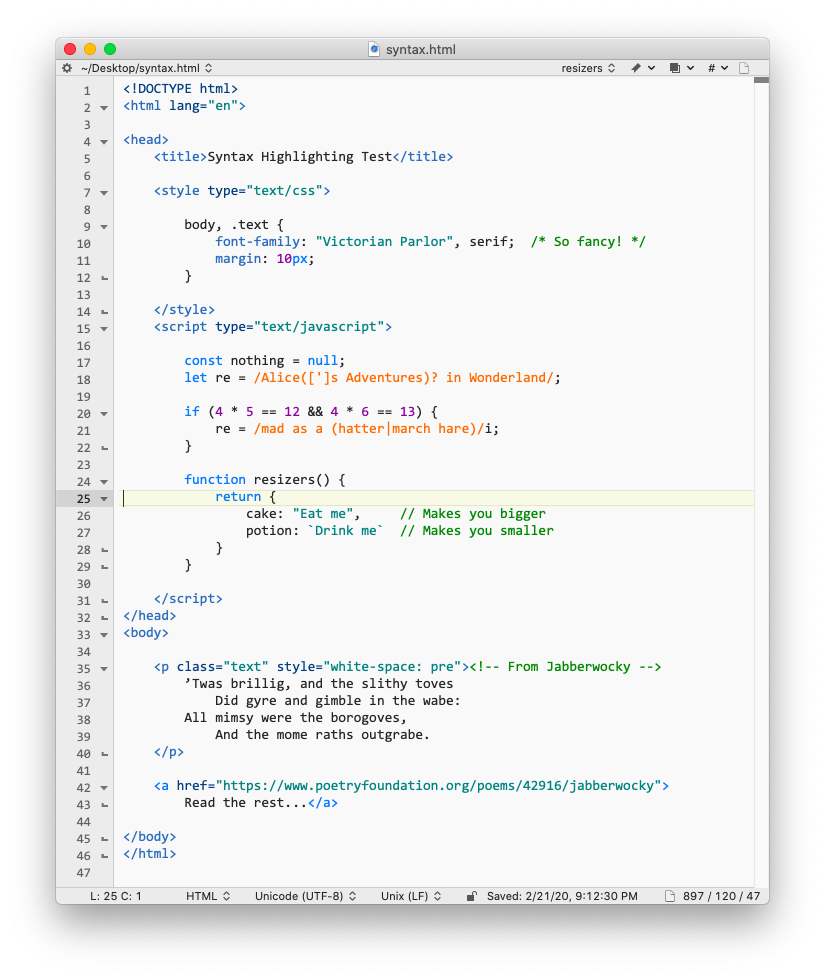
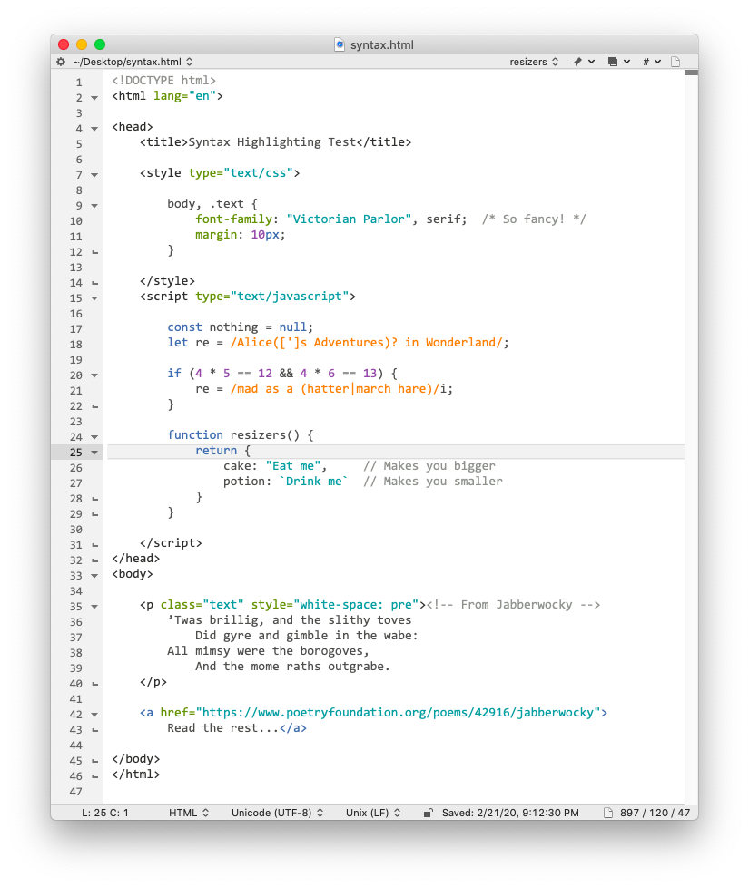

# BBEdit Color Schemes

Color schemes for the excellent [BBEdit text/code editor](https://www.barebones.com/products/bbedit/) (it doesn't suck).   
These themes have been tested on BBEdit v12.6, v13 and v14.

Campsite is based on [Andrew Hazelden's Charcoal v2](https://github.com/AndrewHazelden/More-TextWrangler-and-BBEdit-Color-Schemes/tree/master/Charcoal%20Color%20Scheme).   
Solarized was ported from <https://ethanschoonover.com/solarized/>.   
Tomorrow & Tomorrow Night were ported from <https://github.com/chriskempson/tomorrow-theme>.

### Screenshots

Campsite | Monokainda | Schoon
-------- | ---------- | ---------------
 |  | 

Solarized Dark | Solarized Light
-------------- | ---------------
 | 

Tomorrow Night | Tomorrow
-------------- | --------
 | 

### Installation

Clone this repo, then:

```bash
color_schemes_dir="$HOME/Library/Application Support/BBEdit/Color Schemes"

for bbcs in *.bbColorScheme; do
  cp -i "$bbcs" "$color_schemes_dir/"
done
```

### Activation

In BBEdit, open Preferences and select the Text Colors panel.   
Use the "Color scheme" dropdown to choose a color scheme.

BBEdit remembers whether you're in light or dark mode when you select a color scheme,   
and automatically switches color schemes when you switch between light and dark mode.
